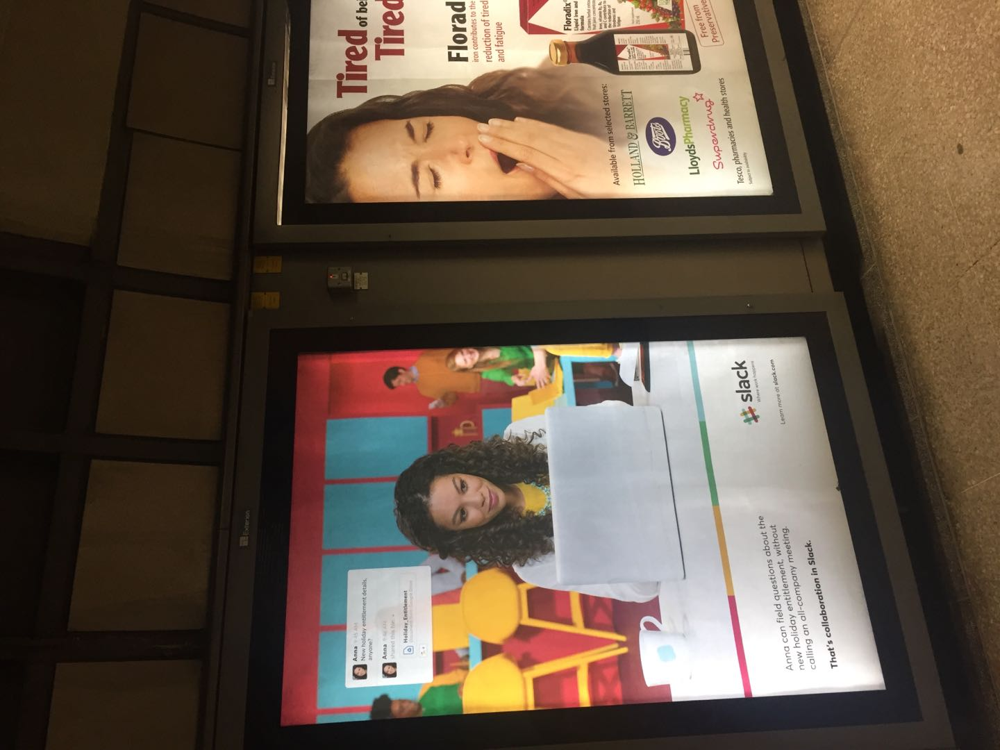
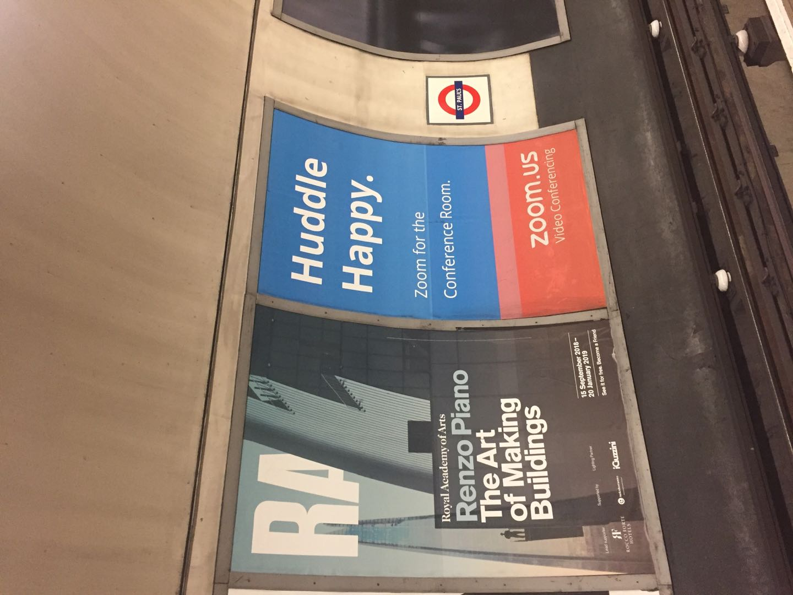
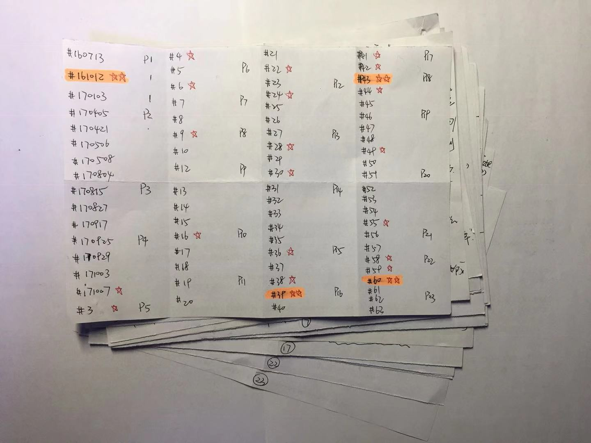
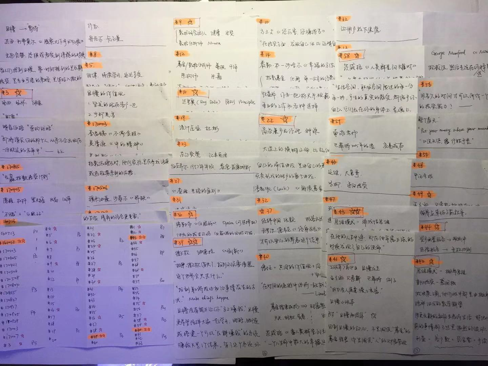
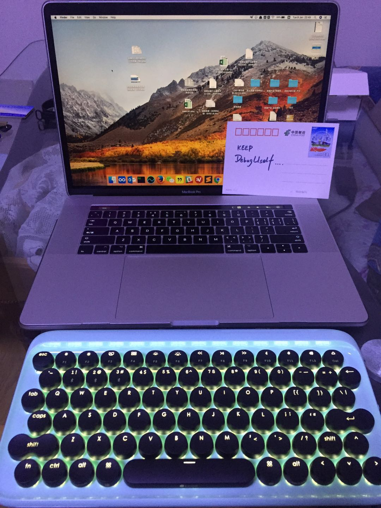

Title: 2018年总结
Tags: debuguself

[TOC]

## 缘起
2018年1月, 计划每月一篇写月度总结. 结果回首, 只写了一篇: [2018年1月总结](http://omlalala.io/2018-02-04-summary-1801.html).

借口是完美主义作怪, 每到月底, 总有各种理由艰难提笔.

所以这次, 无论如何, 先硬着头皮把年度总结补上.

## 提纲
- 工作: 中
- 生活: 优
- 兴趣: 良
	- 投资: 良
	- 心智: 中
	- 编程: 中

## 工作: 中

今年是在现单位的第三年, 回顾今年的重点项目结果以及自己的成长, 均不是很满意.

- 今年行业发生巨变, 监管严峻.
	- 去年下半年还在做新增网点模型, 今年上半年就变成做关店模型了.
	- 第一次深刻体会到行业的政策变化, 对公司/岗位/个人的影响.
- 因为精力分散, 今年在工作上并未加足马力.
	- 只是精进原来负责的项目, 并没有新的项目.
	- 也没有工作中遇到问题而自怼解决的, 可公开分享的作品.

## 生活: 优

今年终于和女神约定终身. 5月办了婚礼, 土鳖的我们在10月第一次出国见了世面.
- 这次去了纽卡斯尔参加女神闺蜜的婚礼, 顺道去了伦敦, 剑桥, 巴黎. 拍的美照太多, 就不放啦.
- 意外发现是, 在伦敦的地铁站, 看到了 [大妈](https://github.com/ZoomQuiet) 在怼圈推荐的两个 APP 的广告, 再一次体会到了 [大妈](https://github.com/ZoomQuiet) 的品味.
	- slack

	- zoom.us

### 电影
平时两人都有看电影的爱好, 今年一共看了 12 部电影.

- 1月19日, 奇迹男孩
- 3月3日, 红海行动
- 4月5日, 头号玩家
- 5月12日, 复仇者联盟3
- 7月7日, 我不是药神
- 7月14日, 邪不压正
- 8月2日, 布达佩斯大饭店
- 8月12日, 一出好戏
- 8月17日, 完美陌生人
- 9月8日, 碟中谍6
- 9月30日, 无双
- 12月15日, 海王
- 12月24日, 蜘蛛侠: 平行宇宙

## 兴趣: 良

我将兴趣分成了三部分: 投资, 心智, 编程. 分别对应三个学习社群.

- 投资 -> 长投学堂
- 心智 -> 开智学堂
- 编程 -> 自怼圈	

### 投资: 良

对投资的精力投入, 主要集中在下半年.

#### 输入
- 读书 4 本
	- 战胜华尔街
	- 手把手教你读财报
	- 巴菲特致股东的信
	- 巴菲特之道
- 课程 2 个
	- 5月14日, 长投股票初级课
	- 7月9日, 长投股票进阶课
- 助教 1 次
	- 7月27日, 长投股票进阶课助教. 课程结束后, 自费给6个小组优秀学员送书6本
- 社群 1 个
	- Bill 的 "翻石头学堂" 知识星球
- 活动 5 场
	- 4月21日-22日, 长投北京线下活动
	- 8月4日, 杨天南北京读者见面会
	- 10月20日-21日, 长投年会 (第三次)
	- 10月27日, 杨天南北京读者见面会
	- 11月24日-25日, 雪球上海嘉年华

#### 输出

- 读书笔记 2 篇

	2018年, 虽然读了几本书, 但只输出了两篇读书笔记.
	也因为懒癌, 没有折腾图片上传博客的技术, 所以没有发在博客上, 只发在了微信公号上.
	- [巴菲特致股东的信](https://mp.weixin.qq.com/s/fvPYC1zQ2YVDF6d3_OKSdg)
	- [手把手教你读财报](https://mp.weixin.qq.com/s/vWZ3NfPVoChVLgILbDaGcw)

- 实盘业绩
	- 今年的投资策略, 还是白马股策略, 没有调仓. 近三年的投资业绩情况如下

|Year|组合业绩|上证指数(000001.sh)|
|---|---|---|
|2016|-16.60%|-12.31%|
|2017|41.36%|6.56%|
|2018|-24.97%|-24.59%|
|Compounded Annual Gain – 2016-2018|-4.00%|-11.02%|
|Overall Gain – 2016-2018|-11.54%|-29.54%|

- 投资感悟
	- 2017年开始, 实践白马股策略. 2018年下半年给了很好的机会, 但是自己不敢加仓.
		- 因为看了巴菲特致股东的信和巴菲特之道, 没有实际分析过公司年报, 所以一直未调仓.
	- 长投年会时, Bill 推荐了 [且慢](https://qieman.com/) 和 [长赢指数投资计划](https://qieman.com/longwin/index).
		- 从10月到年底, 一直在关注, 比较符合自己的投资观. 
		- 目前计划是调整精力, 将更多精力投入工作, 争取更多的现金流, 然后增值的收益, 交给长赢指数投资.
		- 看完了盈米副总裁 [孟岩](https://www.zhihu.com/people/dreamwords/activities) 的 [64 篇投资实证](https://wemp.app/accounts/6b76b87e-c2d4-486d-a6c7-093169ccb250?page=1), 认同其投资理念, 也把文章中的卡片都摘录了一遍.

### 心智: 中
- 输入
	- 课程: 4月, 开智学堂的信息分析课一期 (没有完成大作业...)
	- 活动: 8月, 阳志平老师的生日会
	- 社群: 阳志平老师的 "安人书院" 知识星球
- 输出
	- Null...

### 自怼圈: 中

这部分的总结是最有愧意的, 挖了几个坑, 都没有填满.

怼圈集中的嗯哼, 是在上半年, 下半年的精力又转到投资上了...

#### 机械键盘
[大妈](https://github.com/ZoomQuiet) 一月在怼圈抽奖, 鄙人荣幸获得新年礼物一个: 萌萌的机械键盘一把.

[大妈](https://github.com/ZoomQuiet) 还暖心地附了一枚明信片和祝福: DebugUself

结果..还一直没有发布键盘体验, 借口就是完美主义魔怔, 没有大胆输出屎稿.

此乃愧意一.
	
#### 翻译 Leo 文档
1月25日, 起念翻译 [Leo 官方文档](http://leoeditor.com/).

结果坚持 3 个月的折腾, 成功诞生一个未完成的项目: [释狮大会](https://github.com/DebugUself/leo-editor-cn), 只翻译了总文档的 5%

此乃愧意二.

#### 自怼计划
- 3月3日, 和 [沥川](https://github.com/Hugo1030) 沟通
- 3月11日, 和 [大妈](https://github.com/ZoomQuiet), [阿虎](https://github.com/wuhuhu800), [沥川](https://github.com/Hugo1030) 沟通
- 折腾了一段时间的 [fast.ai](https://www.fast.ai/), 然后, 就没有然后了...

#### 回顾

回顾兴趣方面的时间精力投入, 存在较大问题.

- 没有持之以恒, 产生积累.
- 挖坑前未考虑周全, 挖了未填.

## 2019年展望

结合2018年总结, 发现自身问题在于
- 精力分散, 没有聚焦.
- 输入过多, 输出过少.

因此, 2019年的年度关键词是 "聚焦" 和 "创造".

### 聚焦

最主要的目标, 是将更多精力投入事业, 争取有较大进步.

已经投入的时间/精力承诺
- 2019年1月-3月, [大妈](https://github.com/ZoomQuiet) 的 [蟒营 Python 入门班](https://gitlab.com/101camp)
- 2019年1月-6月, CFA 1级

### 创造

鉴于2018年 "月度" 计划的执行情况(只有一篇), 2019年计划在博客上记录 "周度" 总结.

目的
- 破除完美主义情结, 敢于发布屎稿迭代
- 强制输出, 记录当周所思所得

(图片来源: [大妈](https://github.com/ZoomQuiet) 在 [自怼圈](https://github.com/DebugUself/du4proto/issues/416) 的 issue commit)

以上, 是为2018年总结.
	
## ChangeLog
- 190106 增补链接
- 190104 init
