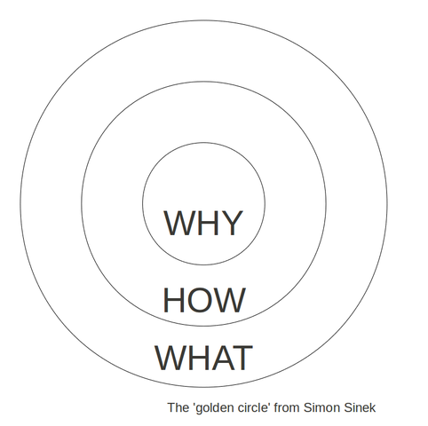
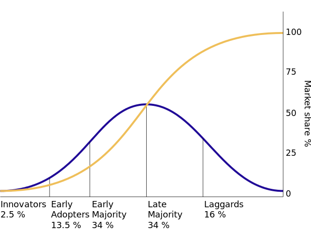
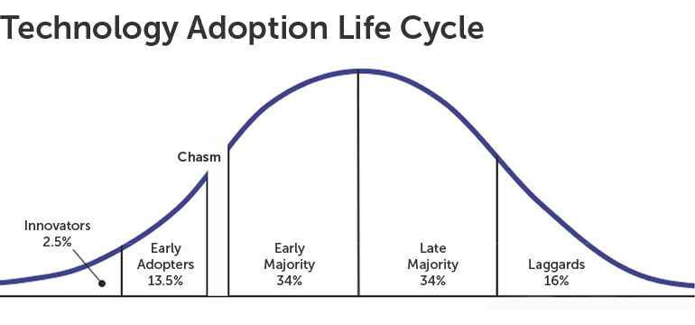

Title: Simon Sinek 的 TED 演讲笔记
Tags: debuguself

[TOC]

## 缘起

周末看到了金栋老师的文章 [指数量化投资 #68 - 长赢Landing页面解读一](https://zhuanlan.zhihu.com/p/55313652), 文中提到
> 在长赢计划3.0改版之前，且慢内部刚刚学习了 Why/How/What 思维框架。
> 这个思维框架来自于 Simon Sinek 的《Start with Why》一书

因为对人名和书名好奇, 所以引发此文嗯哼.

### 人名卡
#### Simon Sinek

- Simon Sinek 是一名作家, 出书五本, 其中比较出名的有:
	- [Start with Why](https://www.amazon.com/gp/product/1591846447/ref=dbs_a_def_rwt_hsch_vapi_taft_p1_i0), 美亚评论 2275 条
	- [Leaders Eat Last](https://www.amazon.com/gp/product/1591848016/ref=dbs_a_def_rwt_hsch_vapi_taft_p1_i1), 美亚评论 1013 条
- Simon Sinek 是一个励志演说家, 在 TED 的演讲, 荣膺 [史上播放次数第三名
](https://www.ted.com/playlists/171/the_most_popular_talks_of_all)
	- 搜索 amazon 时, 发现读者书评也是推荐他的 TED 演讲: [How great leaders inspire action](https://www.ted.com/talks/simon_sinek_how_great_leaders_inspire_action)

参考

- [个人主页](https://startwithwhy.com/)
- [wiki](https://en.wikipedia.org/wiki/Simon_Sinek)

## TED 演讲笔记

下面是其演讲笔记, 看之前以为其提出的 `why-who-what`, 是对 [5W1H](https://wiki.mbalib.com/wiki/5W1H%E5%88%86%E6%9E%90%E6%B3%95) 的深入讨论, 实则不然.

我理解他的主要观点是: 晓之以理, 动之以情. 

根据 [跨年答疑（3）：卡片十二问](https://www.yangzhiping.com/psy/happy-new-year-faq3.html) 建议, 整理 Simon Sinek 的主要观点及收获.

- 首先试举三例, 引出主题: 伟大的领导者如何激励行动
	- Apple
	- Martin Luther King
	- the Wright brother

接着引出自己提出的术语: `golden circle`

### 术语卡 
#### golden circle

(source: https://en.wikipedia.org/wiki/Simon_Sinek)

三个部分

- why -> purpose? cause? belif? your organization exist?
- how
- what

思考方式(顺序)

- 普罗大众: what -> how -> why
- 伟大领袖: why -> how -> what

多元思维(与 biology 结合)

|components of brain|function|golden circle level|
|---|---|---|
|neocortex|rational and analytical thought and language|`what`|
|limbic brain|feelings, behavior, decision-making|`why`and`how`|

### 金句卡

演讲过程中, 多次嗯哼对 `golden circle` 的实践理解, 其中比较喜欢下面的句子.

- People don't buy what you do, they buy why you do it
- The goal is not to do business with everybody who needs what you have. The goal is to do business with people who believe what you believe.
- The goal is not just to sell to people who need what you have; the goal is to sell to people who believe what you believe. 
- The goal is not just to hire people who need a job; it's to hire people who believe what you believe. 

### 意外收获

整理术语卡时, 竟意外收获两个术语.

#### the law of diffusion of innovation

(source: https://en.wikipedia.org/wiki/Diffusion_of_innovations)

术语由 Everett M. Rogers 教授 1962 年首次提出, 介绍了不同的社会大众接受创新技术的过程. 

其著作 [Diffusion of Innovations](https://www.amazon.com/Diffusion-Innovations-5th-Everett-Rogers/dp/0743222091), 不查不知道, 一查吓一跳!

- 美亚 评论 140 条
- goodreads 评分 1066 人, 73 条评论
- **但是 google scholar 引用超 10 万次!**

Two example

- famous failure: TiVo
- famous success: Dr. King "I have a dream" speech

#### Crossing the Chasm

术语由 Jeffrey Moore 1991 年提出, 主要观点是在 `early adopters` 和 `the early majority` 之间, 还存在鸿沟. 著作 [Crossing the Chasm](https://www.amazon.com/Crossing-Chasm-3rd-Disruptive-Mainstream-ebook/dp/B00DB3D81G/ref=sr_1_2?keywords=Crossing+the+Chasm&qid=1548088946&s=Kindle+Store&sr=1-2) 也是经典!

- 美亚 评论 141 条
- goodreads 评分 19691 人, 430 条评论
- 但是 google scholar 引用 4387 次

参考

- [創新擴散模型Diffusion of Innovation](http://blog.udn.com/HsuChunYi/45851952)
- [diffusion-of-innovations 10 万次引用链接](https://scholar.google.com/scholar?hl=en&as_sdt=0%2C5&q=Diffusion+of+Innovations&btnG=)
- 阳老师整理的豆列 [学术界引用最多的 64 本书](https://www.douban.com/doulist/45709528/), *diffusion of innovations* 排第 10 位

深度预警

- 两个意外收获的术语, 还未仔细阅读过相关书籍, 只是照搬 wiki 简述, 仍属司机知识...

### 其他: TED 使用体验
- 看字幕文字时, 点击文字, 视频会自动播放对应位置
- 评论也很有意思, 会有对视频主要观点的补充和建议
- 以上书评记录数据及引用次数, 均截止 190121

## ChangeLog

- 190126 init 
	- 20:25-20:55, .5h, 查资料, 听 TED 第 8 分钟
	- 21:00-21:30, .5h, 听完 TED 后 10 分钟, 看评论, 整理字幕到 04:36.
	- 21:55-22:55, 1h, 整理字幕完毕, 发现两本好书
	- 23:10-00:20, 1h, 补充整理文字, 链接
	- 00:25-00:55, .5h, 补充两个意外收获术语的内容