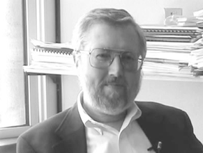
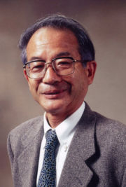

Title:  "这才是心理学 第一章 笔记"
Date:   2017-04-16 15:43:37 +0800
Tags: psychology, stanovich
Slug: 2017-4-15-how-to-think-straight-about-psychology-chap1

[TOC]

全文约：5000字
阅读时间约：10分钟

### 背景
2016年11月，我加入了 [开智通识部落](https://www.douban.com/doulist/45345711/)，部落要求成员：每周精读一本书的一章，然后使用 [卡片大法](http://www.yangzhiping.com/psy/happy-new-year-faq3.html) 撰写三张卡片。

半年一晃而过，终于开始实践。

4月1日-4月15日，按照部落要求，阅读 [《这才是心理学》](https://book.douban.com/subject/26686251/)，下面是按照 [阳志平老师](http://www.yangzhiping.com/)（以下简称阳老）的卡片大法，实践第一章的读书笔记。

初次实践，难免生疏。
还请阳老和开智同侪多提宝贵修改意见。

### 通识部落书单
开智的通识部落要求大家每周读一本书的一章，主题涉猎：理性思维、决策、学习、基因与模因、进化心理学等。

阳老至今已推荐15本书，按照阳老对书的分类，至少归类杰作与神作，从著作背后的作者可见一斑

- 诺贝尔经济学奖得主——丹尼尔•卡尼曼
- “大师中的大师”——詹姆斯•马齐
- 世界顶尖语言学家、认知心理学家——史迪芬•平克

然而即使是他们，也各只有一本著作入选书单。
而书单涉及的共13位作者中，竟有一人，入选三本著作！

- 他是谁？
- 哪些著作入选？
- 为何阳老如此推荐？

三个问题，开始我们的探寻之旅。

### 斯坦诺维奇
此人就是加拿大认知科学家：斯坦诺维奇 (Keith E. Stanovich,
1950年12月13日-)，2012年美国心理学会（APA）终身成就奖获得者。

著作包括

- 阳老引入国内的“理性时代三部曲”

	- [《机器人叛乱》](https://book.douban.com/subject/26412113/)，“继道金斯《自私的基因》后最好看的神作。——阳老”

	- [《超越智商》](https://book.douban.com/subject/26605978/)，“这是世界上最好的认知科学家写得最好的一本“理性”著作。——阳老”

	- 理性与反省心智（国内未翻译）

- 成名作
	- [《这才是心理学》](https://book.douban.com/subject/26686251/)，目前已第10版，"思想深邃，通俗易懂——阳老"。

入选通识部落书单的就是除了 理性与反省心智 之外的三本。

本周我阅读的是，《这才是心理学》的第一章《心理学充满生机：在科学阵营里左右逢源》

### 弗洛伊德问题
第一章由一个非正式的小调查开始
> 在大街上随便拦住100个人，请他们说出一个心理学家的名字。结果，排除“媒体心理学家”后，西格蒙德•弗洛伊德名列榜首，B.F.斯金纳可能会名列次席，但得票数会远远落于弗洛伊德。

但弗洛伊德在公众心理中的形象，远并不能代表其在学术届的认可程度。

斯坦诺维奇首先列举了一些现象

- 主要的心理学组织（APA，APS）中，认可弗洛伊德及精神分析学的会员人数占比不到10%。
- 一本700多页的心理学教科书，提到弗洛伊德和精神分析学的篇幅只有15页，且多是对其的批判。

究其原因，斯坦诺维奇提供了以下分析视角

- 现代心理学涉及的主题、数据和理论中，弗洛伊德的工作只占其中极小的一部分，占更大比重的是五位诺贝尔心理学家等人。
- 现代心理学研究领域众多，APA有54个分支机构，每个分支都是一个非常宽泛的研究领域。
- 弗洛伊德的研究方法不能代表现代心理学。
	- 弗洛伊德不采用控制实验，而后者是现代心理学家最有力的武器。
	- 弗洛伊德认为：个案研究足以证明理论的真实或谬误。
	- 弗洛伊德的理论和研究数据的联系，不能满足符合科学的理论的标准。

刚梳理完 “弗洛伊德的问题” 这张卡片，我很困惑，以为只是粗浅、客观的认识了弗洛伊德，不知如何运用。

直到和朋友交流时，才举一反三：其实斯坦诺维奇通过自身的分析

- 演示了如何使用批判性思维
- 提供了分析”权威“的视角

这样，当以后听到他人推荐心理学家，或其他领域的牛人时，我们会借鉴斯坦诺维奇分析弗洛伊德的例子，运用这些基本的评价角度，更客观的认识他们。

### 科学的定义和特征
为了解决“弗洛伊德问题”，斯坦诺维奇提供了两种办法。

占第一章绝大多数篇幅的第二种办法是：讨论现代心理学所共有的唯一而普遍的特性，即用**科学的方法**，寻求对行为的理解。

对于什么是科学，斯坦诺维奇认为
>
- 科学是一种观察和思考事物以便深入理解其运行机制的方法
- 科学具有三个相互关联的特征
	- 验证可解决的问题
	- 采用系统的实证主义
	- 产生公共知识

对于第三个特征，斯坦诺维奇是这样解释的。
>
- 科学知识是公共性的，即科学知识**并不单独存在于特定个体的头脑之中**。
- 科学知识没有提交给科学团体、接受他人批评和验证之前，是根本不存在的。
- 科学通过**可重复性**实现其公共可检验性的理念，即让其他科学家尝试采用相同实验并获得相同结果
- 这样，一项研究不再仅仅为原始研究者个人所有，它还能够被其他人**获取、扩展、批评**，或以他们的方式得到应用。

当刚写完 “什么是科学”、“产生公共知识” 这些卡片时，我没有太多体验。

但通过近期参与的一项实践，写完另一张术语卡后，我有了更深刻的体会。

- 这项实践，就是参加了大妈的自怼圈。
- 另一张术语卡，就是SECI模型。

### 大妈的自怼圈
- 大妈是谁？
	- 大妈是 [Zoom.quiet](http://zoomquiet.org/)，也是Py103（开智第三期编程思维课程）的总教练。

- 自怼圈是什么？
	- 在课程结束后，大妈建立了自怼圈，学员回炉复训。
	- 在自怼圈中，我们需要通过不断输出，在大妈专业的提点下，完善自身的思维行为，向工程软件领域专业人士的工作思维习惯与行为靠拢。
- 目前的改变？
	- 参与Py103时，我没发过 issue，也几乎没评论。
	- 但在自怼圈中，目前较积极的发布参与评论 issue。
在逐渐改变的输出过程中，我积累了一些基础的经验行为。

结合这些经验行为，在一次听录大妈的演讲时，发现大妈对一个模型的理解，竟与斯坦诺维奇对科学 “产生公共知识” 的解释类似！

这个演讲就是

- 幻灯  [知.时管理](http://s5rst.qiniucdn.com/140303-time4km/index.html)
- 录音[130315-time2km4kn.MP3](http://zoomq.qiniucdn.com/CPyUG/zq2voice/130315-time2km4kn.MP3)

其中，大妈对于第三代知识管理模型的理解如下（幻灯 P32，录音 11:51-16:15 处）
>
- 第三代知识管理，知识存在于不断从外在化到社会化、内化的循环中。**循环一旦停止，知识就不存在了**。
- 知识是动态的行为，不是静态的东西。一个机构，静态知识流转的越快，知识储备越多，这是速率的竞争。
- 知识管理举例
	- 进入一个新的岗位，获得一堆文档／代码／规章制度，均属于外在化东西。
	- 当你组合／尝试／应用到场景中，内化，变成自己的经验，独立解决问题。
	- 解决完，**反思**方法是否最优，**抛回**领导／同事／代码库中，**设法流传**。
	- 同事**反复引用**，固化成新文档／模块。

试看两类解释的相似之处

- 公共性
	-  斯坦诺维奇：“...没有提交...接受批评和验证...根本不存在”
	-  大妈：“...不断...循环...一旦停止，知识就不存在...**”
- 可重复性、验证性
	- 斯坦诺维奇：“...获取、扩展、批评，...得到应用”
	- 大妈：“...反思...抛回...设法流传...反复引用...固化成新的...”

那么，回答源头，大妈提到了第三代知识管理模型——SECI模型

- 谁提出了SECI模型？
- SECI模型是什么？

### 野中郁次郎与SECI模型
- 野中郁次郎是谁？
	- ”世界知识管理之父“ [野中郁次郎](http://wiki.mbalib.com/wiki/%E9%87%8E%E4%B8%AD%E9%83%81%E6%AC%A1%E9%83%8E)（Ikujiro Nonaka，1935年5月10日-）

	- 

	- 代表作是他和竹内弘高合著的 [《创造知识的企业》](https://book.douban.com/subject/1811450/)（The Knowledge Creating Company）。

- SECI模型源头？
	- 1994年，野中郁次郎在论文 [A Dynamic Theory of Organizational Knowledge Creation](https://scholar.google.com/scholar?q=A+Dynamic+Theory+of+Organizational+Knowledge+Creation&hl=zh-CN&as_sdt=0&as_vis=1&oi=scholart&sa=X&ved=0ahUKEwjl4N2xwKbTAhXoilQKHeHpAj4QgQMIIzAA) 中提出了SECI模型，这篇论文目前在google Scholar 中被引用次数超过2万。
- SECI模型是什么？

现在，再回顾大妈的语音，才重新理解知识循环中的外在化、内在化、社会化等概念，明白了为什么要不断输出。

### 对翻译的困惑
阅读第一章的过程中，采用了中英结合的方法：先中文后原文。
但实践中，产生了一些困惑。

#### 1. 实证主义？positivism or empiricism ?
如果统计第一章的词频，排在前三位的可能是

- 心理学
- 科学
- 实证

在通识部落的仓库中，阅读其他同侪撰写的卡片时，发现术语卡 “实证主义” 的英文对应的是 positivism。
但斯坦诺维奇在原书第一章，使用的却是 empiricism。
那么，问题来了

- 什么是 positivism？
- 什么是 empiricism?
- 二者区别与联系是什么？

通过分别阅读这两个词在wiki的解释，我觉得斯坦诺维奇用词无误，确实应使用 empiricism，理由是

- [Empiricism](https://en.wikipedia.org/wiki/Empiricism) 的前三段说明定义。
	- Empiricism in the philosophy of science emphasizes evidence, especially as discovered in experiments.

- [positivism](https://en.wikipedia.org/wiki/Positivism#The_role_of_science_in_social_change) 的前两段说明了联系与区别
	- Positivism is a **philosophical** theory
	- Verified data (positive facts) received from the senses are known as **empirical evidence**; thus **positivism is based on empiricism**.

#### 2. 科学的统一性 ？
第一章第三节的标题是："科学的统一性"。
请问，当你看到此标题时，你认为这个标题对应的是下面哪个主题？

- 心理学的多样性
- 心理学的统一性
- 科学的多样性
- 科学的统一性

显而易见，一开始我选的是第四个。
但是反复读完上下文后，我觉得其实这节的主题应该是第二个，即心理学的统一性：采用科学方法。

理由有两个

- 前后文及本节主要内容。
- 原文是 Unity **in** Science, 不是 Unity **of** Science

#### 3. 54 还是 56？
这个问题可能显得吹毛求疵了，对于美国心理学会（APA）分支机构的数量

- 原文是54个，因为虽然序号从1到56，但是没有分支4和分支11。
- 翻译版本却是56个。

给我带来的困惑是，我专门核对了表中列出的内容，很长时间没有明白为什么不是54个。
当然，这个困惑也提醒我，在阅读时，需要将更多精力放在作者的论点、论据、应用卡片大法上，而不是细枝末节上。

### 总结

以上就是我使用卡片大法阅读第一章的实践笔记。
第一章很精彩，还有很多内容在此文未涉及，比如 “常识的误区” 等节。
谢谢阅读，也还请各位多提宝贵意见。

### ChangeLog
20170415 Init
